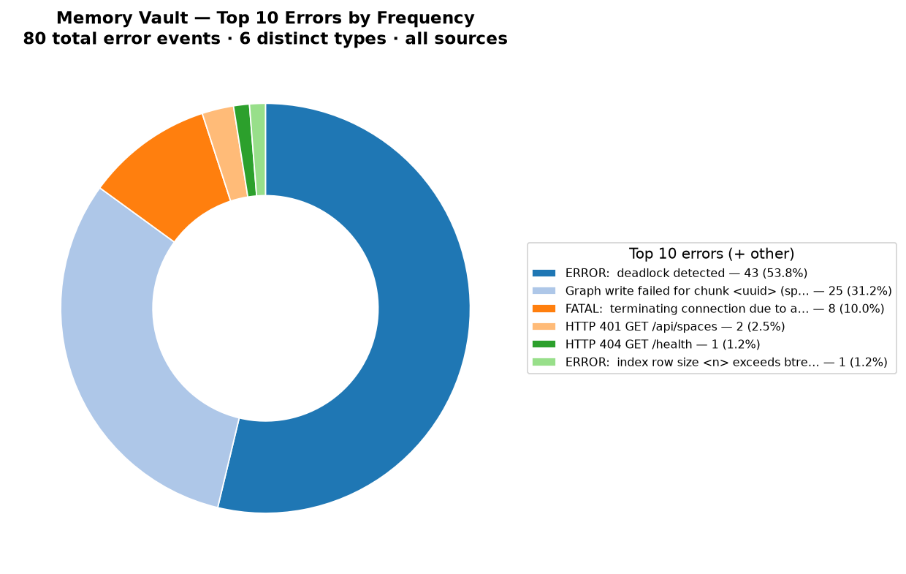

# Fix Logging Plan — Memory Vault

> **Applies to: Memory Vault** — the self-hosted, Postgres/pgvector-backed semantic memory app at `/Users/garyhawley/memory-vault/memory-vault` (MCP server + REST API + AI ingest/search/chat workflow + Postgres). Not the `km-sales-app` / `fleetiq` projects — those are memory *spaces* stored inside this app.
>
> Status: **Ready for implementation** · Created 2026-06-28 · Owner: gary
> Scope: (A) fix errors surfaced by log analysis, (B) close logging-coverage gaps (all container + agent logs, verbose mode), (C) document current archiving/purging, (D) consolidated master fix list F1–F12.
> Pre-implementation requirement met: current archiving & purging methods determined (Part C).

---

## Part A — Error findings & fixes

Analysis covered **31,015 log lines** across **all five sources** (2 host files, 1 host jsonl set, 2 Docker containers). **80 error events, 6 distinct types.**



| # | Error signature | Count | % | Source | Root cause | Fix |
|---|---|---:|---:|---|---|---|
| 1 | `ERROR: deadlock detected` | 43 | 53.8% | Postgres | Concurrent graph/entity upserts acquiring locks in inconsistent order | **Order writes deterministically** (sort entity/edge keys before upsert) and **retry on SQLSTATE `40P01`** with backoff. Consider serializing graph writes per-space. |
| 2 | `Graph write failed for chunk <uuid> (space N) — chunk retained, graph data absent` | 25 | 31.2% | app.jsonl | App-level fallout of #1 — chunk saved, edges dropped | Resolved largely by fixing #1. Add a **reconciliation job** to re-derive graph edges for chunks whose graph write failed. |
| 3 | `FATAL: terminating connection due to administrator command` | 8 | 10.0% | Postgres | Connections killed on container restart/shutdown | Mostly benign restart noise. **Add graceful pool drain** on SIGTERM so in-flight queries finish before shutdown. |
| 4 | `HTTP 401 GET /api/spaces` | 2 | 2.5% | app (container) | Unauthenticated calls from Docker gateway `192.168.65.1` | Auth **is** enforced in the container path. Reconcile with host path (which returned 200 tokenless) — see Part B note on inconsistent enforcement. |
| 5 | `HTTP 404 GET /health` | 1 | 1.2% | app | Probe hit `/health`; real route is `/api/health` | **Fix health-check path** in compose/monitor to `/api/health`. |
| 6 | `ERROR: index row size 5152 exceeds btree maximum 2704 for "entities_name_type_space_idx"` | 1 | 1.2% | Postgres | An entity name+type value too large for a btree index | **Switch to a hash index** on that column, or **truncate/normalize** the entity key before indexing. Silent data-quality bug — the row never indexes. |

**85% of all errors (#1+#2) are one incident at two altitudes.** Fixing the Postgres deadlock collapses the bulk of the error volume. No data loss — chunks are retained; only graph edges drop.

---

## Part B — Logging coverage gaps ("are we seeing ALL container + agent logs? verbose?")

**Short answer: No.** Container logs are captured but fragmented and at risk; **agent (MCP) logs are not captured at all**; and **verbose (DEBUG) logging is off everywhere.**

### Current logging topology (what was discovered)

| Stream | Destination today | In analysis pipeline? | Problem |
|---|---|---|---|
| App (API/CLI/worker) — structlog | stderr **and** rotating file (`./logs/app.jsonl` on host, `/var/log/memory-vault/app.jsonl` in container via `app_logs` volume) | host file ✅ / container stderr ✅ via `docker logs` / container **volume file** ❌ | **4 fragmented destinations** depending on how it's launched (host launchd vs. container). Easy to read one and miss the others. |
| Postgres (db container) | `docker logs` (stdout) | ✅ | **No log driver rotation** configured → unbounded; lost on `docker compose down`/recreate. 65% of all errors live here. |
| Docker daemon json-file driver | default, **no `max-size`/`max-file`** | n/a | Unbounded growth; truncation/loss risk; no central retention. |
| **MCP server ("agent")** | `logging.basicConfig` → **stderr only**, plain text, **INFO hardcoded** | ❌ **Not captured** | Logs land in whatever launches the MCP server (Claude Code's MCP log capture), never reach Memory Vault's files/Docker/dashboard. **Ignores `LOG_LEVEL`.** Not JSON. No file. No rotation. |

### Verbose logging status

- `LOG_LEVEL=INFO` in `docker-compose.yml`; code defaults to `INFO` (`src/logging_config.py`).
- Third-party loggers (`httpx`, `httpcore`, `urllib3`, `asyncio`) are **force-quieted to WARNING** unless `LOG_LEVEL=DEBUG`.
- The MCP agent is **hardcoded to INFO** and won't go verbose even if `LOG_LEVEL=DEBUG` is set.
- **Conclusion: there is no verbose/DEBUG visibility today.**

### Logging fixes (added to plan)

1. **Bring the MCP agent into `configure_logging()`.** Replace the `logging.basicConfig(level=INFO)` in `src/mcp/server.py` with a call to the shared `configure_logging()` so the agent emits **JSON, honors `LOG_LEVEL`, and writes to a file** (e.g. `LOG_FILE=logs/mcp-agent.jsonl`). *(Highest-value gap — agent is currently invisible.)*
2. **Single canonical log directory + ship to one sink.** Standardize on `LOG_FILE` so host and container write to a predictable, mounted path; mount the `app_logs` volume to a host bind so the container's volume files are reachable. Eliminate the host-vs-container split.
3. **Configure Docker log rotation.** Add a `logging:` block to both services in `docker-compose.yml`:
   ```yaml
   logging:
     driver: json-file
     options: { max-size: "10m", max-file: "5" }
   ```
   Prevents unbounded growth and loss on recreate.
4. **Add a verbose toggle.** Document `LOG_LEVEL=DEBUG` (compose override / `.env`) and make the MCP agent respect it (covered by #1). Add a `memory-vault` CLI `--verbose` flag that exports `LOG_LEVEL=DEBUG`.
5. **Capture DB logs to a file/sink**, not just `docker logs`: enable Postgres `logging_collector=on` with a mounted log dir, or ship container stdout to a persistent collector. 65% of errors are here — they must survive container recreation.
6. **Reconcile auth enforcement** (ties to error #4): the container path returns `401` for tokenless `/api/spaces` while the host path returned `200`. Make enforcement uniform and **log every auth decision at DEBUG** so the dashboard can audit it.
7. **Unify format.** MCP agent logs are plain text; everything else is JSON. Make the agent emit JSON (via #1) so a single parser covers all sources.

### Definition of done

- [ ] One documented command surfaces **every** source: host files, container volume, both `docker logs`, **and** the MCP agent.
- [ ] `LOG_LEVEL=DEBUG` produces verbose output across API, worker, **and** MCP agent.
- [ ] Docker log rotation configured; no unbounded files.
- [ ] DB logs persist beyond container lifetime.
- [ ] Deadlock (#1/#2) ret/ordering fix merged; error volume re-measured.

---

## Part C — Current archiving & purging methods (as-is, before any change)

Determined by inspecting code, `docker-compose.yml`, `~/.docker/daemon.json`, the autostart plist, and live `pg_settings`. **Only one stream self-purges; everything else is either unbounded or ephemeral.**

| Stream | Archiving (rotation) | Purging (retention) | Status |
|---|---|---|---|
| App `app.jsonl` (host `./logs/` **and** container `/var/log/memory-vault/` volume) | `TimedRotatingFileHandler(when="midnight", backupCount=7)` — rotates daily at midnight | Auto-deletes backups older than **7 days** | 🟡 Works, but **time-based only (no size cap)** — a high-volume day is one file; 7-day window can drop history fast |
| Docker container logs — **app** (stdout/stderr → json-file) | **None** — compose has no `logging:` block; `daemon.json` has no `log-opts` | **None** — unbounded; cleared only on container removal | 🔴 Grows until disk full; no rotation, no purge |
| Docker container logs — **db / Postgres** | **None** (same as above) | **None** | 🔴 **65% of all errors live here** and are never archived |
| Postgres internal logging | `logging_collector=off`, `log_destination=stderr` → PG writes **no files of its own**; `log_rotation_age=1440`/`log_rotation_size=10240` are **inert** (only apply when collector is on) | Inherits Docker's (none) | 🔴 PG rotation settings are dead config; retention = Docker's = none |
| **MCP agent** (`logging.basicConfig` → stderr) | **None** — no file handler at all | **None** — ephemeral; lost when process exits | 🔴 No archiving, no purging, not even persisted |
| Host launchd `launchd.out.log` / `launchd.err.log` (autostart plist `StandardOutPath`/`StandardErrorPath`) | **None** — launchd appends, never rotates | **None** | 🔴 Unbounded append; no rotation |

**Summary:** the *only* working purge is the app jsonl 7-day daily rotation. Docker (app + db), Postgres-via-stderr, the MCP agent, and the launchd out/err files have **no archiving and no purging** — they either grow without bound or vanish on restart. There is **no central retention policy** and **no size-based cap anywhere**.

---

## Part D — Master consolidated fix list (ALL issues)

Every logging issue from Parts A–C with an owner-ready fix, prioritized. **P0 = do first.**

| ID | Priority | Issue (source) | Fix |
|---|---|---|---|
| F1 | **P0** | Postgres deadlock (#1) → graph-write failures (#2) = 85% of errors | Deterministic key ordering for entity/edge upserts + retry on SQLSTATE `40P01` with backoff; serialize graph writes per-space |
| F2 | **P0** | MCP **agent logs not captured** & ignore `LOG_LEVEL` (Part B) | Replace `logging.basicConfig` in `src/mcp/server.py` with the shared `configure_logging()`; set `LOG_FILE=logs/mcp-agent.jsonl` → JSON, file-persisted, honors `LOG_LEVEL` |
| F3 | **P0** | Docker logs **unbounded, never purged** — app + db (Part C) | Add `logging: {driver: json-file, options: {max-size: "10m", max-file: "5"}}` to both compose services |
| F4 | **P1** | DB logs lost on container recreate; 65% of errors (Part B/C) | Persist DB logs: bind-mount or ship container stdout to a durable collector; optionally `logging_collector=on` with a mounted dir |
| F5 | **P1** | Verbose/DEBUG off everywhere (Part B) | Document `LOG_LEVEL=DEBUG` override; add `memory-vault --verbose` CLI flag exporting it; ensure agent (via F2) respects it |
| F6 | **P1** | Fragmented log destinations (host vs container volume vs stderr) (Part B/C) | Standardize on `LOG_FILE`; bind-mount `app_logs` volume to a host path so one canonical directory holds all app logs |
| F7 | **P1** | App rotation is **time-only, 7 days, no size cap** (Part C) | Add size-based rotation (or a `RotatingFileHandler` combo / increase `backupCount`); make retention configurable via env (`LOG_BACKUP_COUNT`, `LOG_MAX_BYTES`) |
| F8 | **P2** | Host `launchd.out/err.log` unbounded, no rotation (Part C) | Route launchd stderr/stdout into the app's rotating logger, or add a `newsyslog.conf` / size cap for those two files |
| F9 | **P2** | Inconsistent auth enforcement — container 401 vs host 200 (#4) | Unify auth across host/container paths; log every auth decision at DEBUG for audit |
| F10 | **P2** | Health-check hits wrong path `/health` (#5) | Point compose/monitor health check at `/api/health` |
| F11 | **P2** | btree index row size > 2704 on `entities_name_type_space_idx` (#6) | Switch to a hash index or truncate/normalize the entity key before indexing |
| F12 | **P3** | Mixed log formats (agent plain-text vs JSON elsewhere) (Part B) | Resolved by F2 — agent emits JSON so one parser covers all sources |

### Definition of done

- [ ] **F1**: deadlock fix merged; error volume re-measured from logs (expect ~85% drop).
- [ ] **F2**: MCP agent emits JSON to `logs/mcp-agent.jsonl` and honors `LOG_LEVEL`.
- [ ] **F3**: `docker logs` rotation capped (`max-size`/`max-file`) on both services.
- [ ] **F4**: DB logs survive `docker compose down && up`.
- [ ] **F5**: `LOG_LEVEL=DEBUG` produces verbose output across API, worker, **and** agent.
- [ ] **F6/F7**: one canonical, size+time bounded log directory; retention env-configurable.
- [ ] One documented command surfaces **every** source: host files, container volume, both `docker logs`, and the agent.
- [ ] **F8–F11**: launchd logs bounded; auth uniform; health path fixed; index error gone.

---

## Part E — Comprehensive component & AI-workflow logging audit (2026-06-28)

Five parallel auditors examined every subsystem's logging line-by-line. **Headline: 23 of 36 source files have zero logging, and the AI workflow is almost entirely uninstrumented at the step level.** Successes are never logged; many failures are swallowed or only caught by a single generic catch-all far from the failing step.

### E.1 — Per-component ("each agent") confirmation

| Component | START | SUCCESS | FAILURE | Structured? | Verdict |
|---|---|---|---|---|---|
| **MCP agent** (`mcp/server.py`) | ❌ none | ❌ none | partial (`logger.exception` only) | ❌ uses `basicConfig`, ignores `LOG_LEVEL`, no `request_id` | 🔴 Blind to all normal traffic; `forget` (a delete) has no audit log |
| **Ingestion** (`services/ingestion.py`) | ❌ | ❌ (only `completed += 1`) | file-level only | ✅ | 🔴 Per-chunk insert can silently drop half a file |
| **Embedding** (`services/embedding.py`) | load only | ❌ | ❌ inference failure unlogged | ✅ | 🔴 Zero/NaN/wrong-dim vectors inserted silently (un-retrievable) |
| **Adapters** (`adapters/*.py`) | ❌ | ❌ | ❌ swallows | ❌ zero logging | 🔴 Claude→plaintext misclassification silent → corrupted ingest |
| **Graph extraction** (`extraction/*.py`) | ❌ | ❌ | `logger.exception` w/o SQLSTATE | ✅ | 🔴 Deadlock cause invisible; no retry; dropped chunks unrecoverable |
| **Chat/LLM** (`routers/chat.py`) | ❌ | ❌ | generic catch-all only | ✅ | 🔴 LLM-unreachable & empty-output returned to client but never logged |
| **LLM call** (inline httpx in `chat.py`) | ❌ | ❌ | ❌ | ❌ zero | 🔴 No model/latency/tokens/cost/finish-reason ever captured |
| **Search** (`services/search.py`) | ❌ | metrics computed then discarded | ❌ | ✅ | 🟡 `/search` logs to `query_log`; **chat retrieval bypasses it** |
| **Auth** (`api/deps.py`) | ❌ | ❌ | ❌ **no auth decision ever logged** | ✅ infra ready | 🔴 Security gap; auth-disable is silent (root cause of tokenless-200) |
| **Middleware** (`api/middleware.py`) | ❌ no access log | — | — | ✅ binds `request_id` | 🔴 `request_id` plumbed but **never an access log line emitted** |
| **DB** (`models/db.py`) | pool open/close ✅ | — | `execute_query` ✅ but `fetch_one`/`fetch_all` ❌ | ✅ | 🟡 Read-path query failures bubble raw with no SQL context |
| **Routers** (chunks/spaces/graph/ingest/search) | ❌ | ❌ | rely on global handler | ✅ | 🟡 All 4xx (401/404/409/413/429) unlogged |
| **Config** (`config.py`) | ❌ | — | ❌ silent defaults (incl. default DB password) | — | 🟡 Bad `DB_PORT` raises raw at import; no startup validation log |
| **Global handler** (`api/app.py`) | — | — | ✅ `logger.exception` full stack, no swallow | ✅ | 🟢 Correct — the one bright spot |

### E.2 — Is the AI workflow fully logging each step? **No.** End-to-end trace:

| # | AI workflow step | Logged today? | Critical gap |
|---|---|---|---|
| 1 | Ingest request received (`ingest_text`) | ❌ nothing | API ingest path is 100% silent — success and failure |
| 2 | Adapter detect + parse | ❌ | Malformed Claude export silently downgraded to plaintext → semantic corruption |
| 3 | Chunking | ❌ | Zero-chunk warned; partial drops not |
| 4 | **Embedding (model inference)** | ❌ | Inference failure unlogged; **degenerate/zero/wrong-dim vector inserted silently** |
| 5 | **DB chunk insert** | ❌ (count only) | Per-chunk failure aborts file mid-loop → silent partial ingest, no per-chunk attribution |
| 6 | Entity/relationship extraction (spaCy) | ❌ | Model-load success unlogged; zero-entity indistinguishable from disabled extractor |
| 7 | **Graph write (upsert)** | failure only, no SQLSTATE | Deadlock (40P01) undiagnosable; no retry; dropped chunks have no DB marker to reconcile |
| 8 | Query retrieval (hybrid search) | partial | Chat retrieval bypasses `query_log`; result count/scores/latency discarded |
| 9 | **LLM request (stream + non-stream)** | ❌ | `ConnectError` (LLM down — the #1 real failure) returned to client, never logged |
| 10 | Streaming token loop | ❌ | Mid-stream break → truncated answer delivered with **zero** log evidence; malformed SSE dropped silently |
| 11 | Response complete | ❌ | No latency, no `finish_reason`, **no token usage / cost** captured anywhere |

**Successes: logged at 0 of 11 steps. Failures: silently swallowed or only caught generically at 8 of 11 steps.** The AI workflow — the system's core — is effectively a black box.

### E.3 — New fixes from the audit (extends Part D)

Grouped by subsystem; all severities. (F1–F7 retention/error fixes from Part D still stand; F2 already wires the MCP agent into `configure_logging()`.)

**MCP agent**
| ID | Pri | Fix |
|---|---|---|
| F13 | P0 | Add START + SUCCESS logs to `recall`/`remember`/`forget`/`memory_status` (counts, space, latency); **audit log for `forget`** (chunk_id) — it's a delete with no trail |
| F14 | P1 | Log every DB-offline degradation branch (6 tools/resources return empty/error JSON silently) |
| F15 | P1 | `_ensure_db`: use `logger.exception` (stack) not `logger.error("...%s", e)`; wrap `list_spaces`/`memory_stats` (no try/except today) |
| F16 | P1 | Bind per-call `request_id` + tool name so MCP invocations are correlatable |

**Ingestion / embedding / adapters (AI workflow front half)**
| ID | Pri | Fix |
|---|---|---|
| F17 | P0 | Validate embedding output: reject/log zero-vector, NaN, and dim ≠ `embedding_dimensions` before insert (`embedding.py`) — stops silent un-retrievable chunks |
| F18 | P0 | Wrap per-chunk insert in try/except with `i/N` attribution; emit `Ingested X/Y chunks` summary (`ingestion.py:142`) — stops silent partial ingest |
| F19 | P0 | Log Claude-export → plaintext misclassification at `adapters/base.py:130-132` |
| F20 | P1 | Instrument `ingest_text` API path fully (start/unknown-space/success) — currently 100% silent |
| F21 | P1 | Log embedding model-load failure and inference failure with model+batch context; log the model's **actual** output dim, not the config constant |
| F22 | P2 | File-processing START + SUCCESS (chunks, embeddings, latency) in `_process_file` |

**Graph extraction (AI workflow — highest-error subsystem)**
| ID | Pri | Fix |
|---|---|---|
| F23 | P0 | Capture `exc.sqlstate` + `diag.message_primary` in the graph-write failure log so 40P01 deadlocks are filterable (`graph_writer.py:93`) |
| F24 | P0 | Retry on `40P01`/`40001` with backoff + per-attempt WARNING log (merges with F1) — likely removes most of the 25 failures |
| F25 | P0 | Durable failure record: `chunks.graph_status` column **or** `graph_write_failures` dead-letter table → reconciliation job can re-drive dropped chunks (today only log-string greppable) |
| F26 | P1 | Graph-write SUCCESS log (entities/mentions/rels/rows/latency); log spaCy model-load **success** |

**Chat / LLM workflow (AI workflow back half)**
| ID | Pri | Fix |
|---|---|---|
| F27 | P0 | Log `httpx.ConnectError` in both stream and non-stream LLM paths (`chat.py:354,596`) — the most common production failure, currently invisible |
| F28 | P0 | Chat retrieval success log + route chat queries through `log_query` (parity with `/search`) |
| F29 | P0 | Stream-interruption log with `tokens_sent`/`elapsed_ms` + emit a partial/error SSE marker so truncation is detectable |
| F30 | P1 | Replace `except Exception: pass` model-probe swallow with a warning (`chat.py:219`) |
| F31 | P1 | Log native→OpenAI-compat fallback transition (`chat.py:307,567`) |
| F32 | P1 | Log empty LLM content and empty retrieval branches (`chat.py:330,342,264,522`) |
| F33 | P1 | `chat complete` success log + parse `usage` for prompt/completion **token & cost capture** (captured nowhere today) |

**API / auth / DB / config (security + transport)**
| ID | Pri | Fix |
|---|---|---|
| F34 | P0 | Log every auth decision — accept / missing-header-401 / invalid-or-revoked-401 — with client IP + token prefix (never full token) (`deps.py:79,102,108`) |
| F35 | P0 | Loud startup WARNING when `API_AUTH_ENABLED` is off (`deps.py:75`) — the silent root cause of the tokenless-200 finding (#4) |
| F36 | P1 | Add HTTP access-log middleware: method/path/status/latency/request_id (plumbing already exists) — single highest-leverage addition |
| F37 | P1 | Give `fetch_one`/`fetch_all` the same `logger.exception` + SQL context that `execute_query` has (`db.py:79-98`) |
| F38 | P1 | `init_pool`: log pool-open failure with stack (`db.py:37`) |
| F39 | P2 | Log rate-limit 429s + token create/revoke lifecycle (admin audit) (`deps.py:141`, `deps.py:41-59`) |
| F40 | P2 | Config startup validation log; warn on default DB credentials (`config.py`) |

**Cross-cutting**
| ID | Pri | Fix |
|---|---|---|
| F41 | P1 | Add a small **step-logging helper** (start/success/failure with latency) and apply it uniformly across the 11 AI-workflow steps so coverage is consistent and future steps inherit it |
| F42 | P1 | **Preserve the privacy rule** (`logging_config.py:13`): log identifiers, counts, scores, lengths, latencies — never raw query/answer/content. All fixes above already follow this |

---

## Reproduce the analysis

```bash
# from repo root; pulls host files + both containers, ranks errors, renders pie chart
uv run --with matplotlib python3 scripts/analyze_logs.py   # (script staged in scratchpad)
```
Artifacts: `docs/log-analysis-top-errors.png`, structured `error_analysis.json`.
